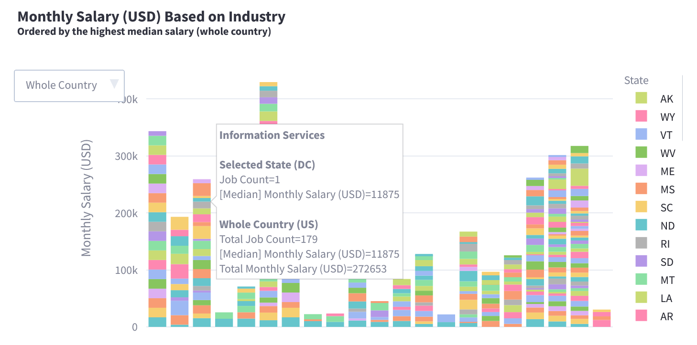
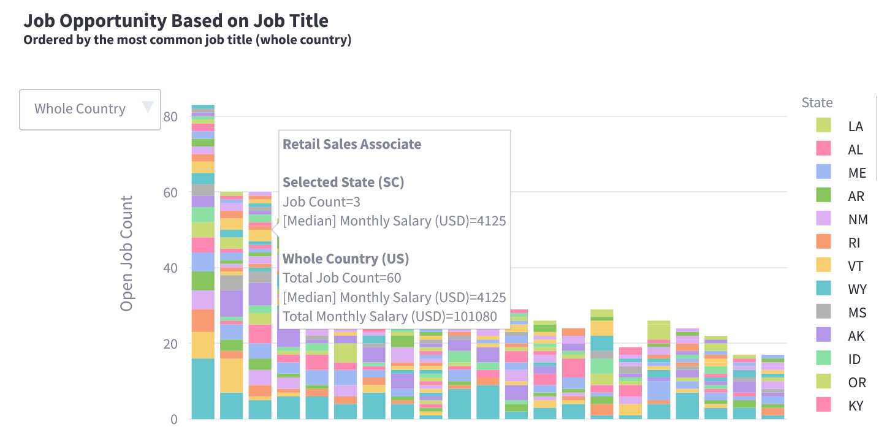
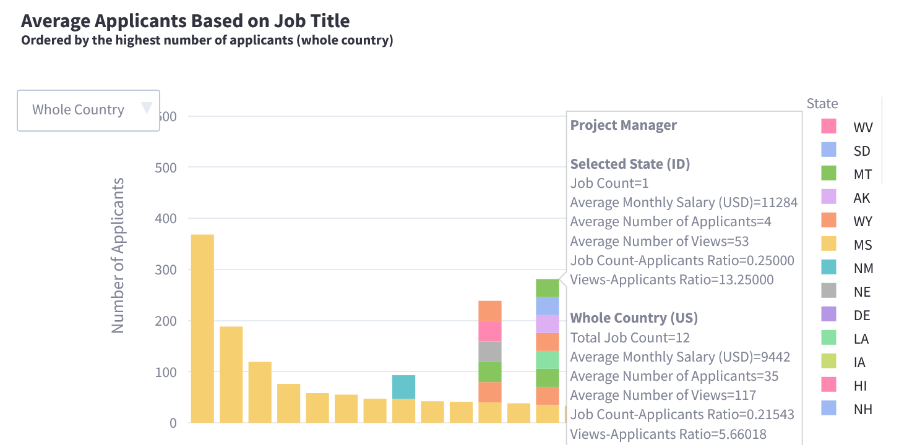
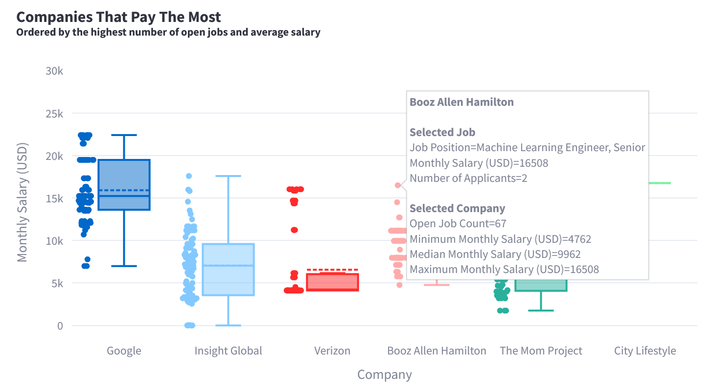
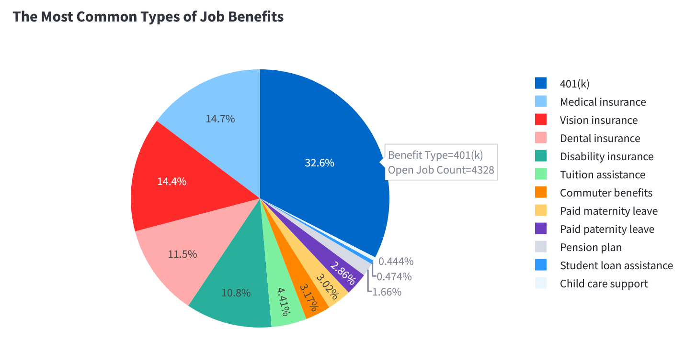
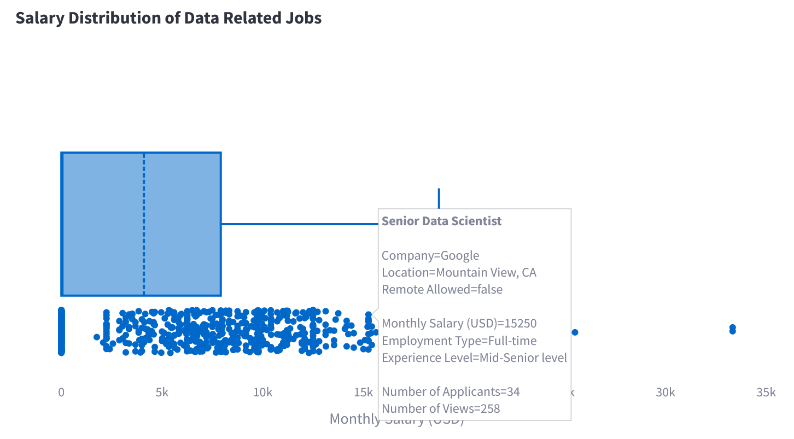
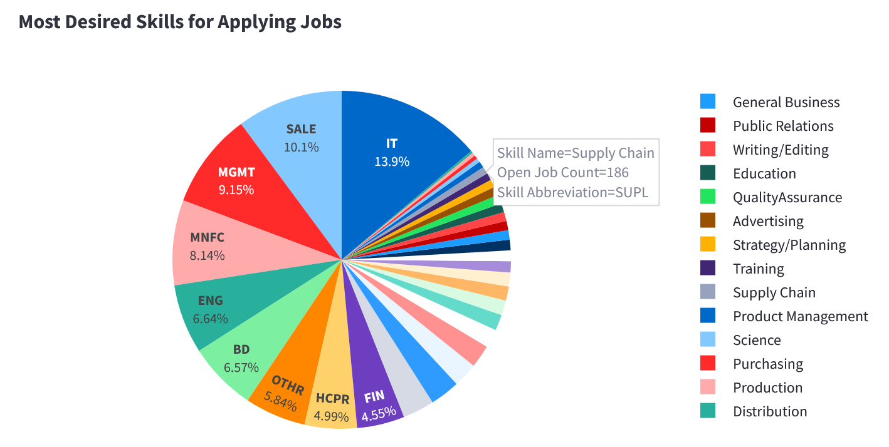
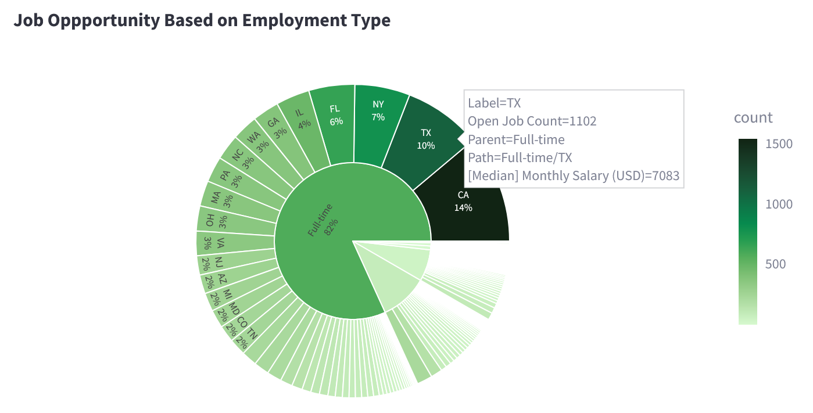

# LinkedIn Job Postings Analysis
LinkedIn job postings analysis (over 15000 data) using Apache Spark, Plotly, and Streamlit. Mainly focused on open job count and monthly salary, can be filtered per state or as the whole country (US). There are also some insights that are focused on companies rather than states/areas.

## Why the US? Why not Indonesia?
I already tried scrapping Indonesian job data for a few weeks, but there's still not much to analyze. Most of my graphs rely on salary data, while most Indonesian companies are not that open yet. Out of the 5000 job postings I scrapped, there's only 1 post that provided the salary data (I wish I was joking). Therefore, I decided to use the US data instead.

## Setup
For setting up Apache Spark and other requirements (without Docker), please see [SETUP.md](SETUP.md).

Note that if you don't use the setup above, Apache Spark can also work locally and be installed using Python `pip`. However, you won't be able to connect to Metabase and only 1 Spark cluster can be used (which doesn't have any advantage compared to Pandas).

## Plotly Visualization

To release the full power of the graphs, it's recommended to run the [notebook](main.ipynb) file directly since **the graphs are interactable**. GitHub doesn't support interactive graphs so I need to export it as images as a workaround.

Here are some random examples you can view. Alternatively, you can also view all the graphs on my [Streamlit Cloud](https://lkjpa-wmjdhrv64dbbhyl6wn6wpa.streamlit.app/).

    
Salary Distribution Based on Experience Level

    

    
Monthly Salary (USD) Based on Industry

    

    
Job Opportunity Based on Job Title

    

    
Average Applicants Based on Job Title

    

    
Companies That Pays The Most

    

    
The Most Common Types of Job Benefits

    

    
Salary Distribution of Data Related Jobs

    

    
Most Desired Skills for Applying Jobs

    

    
Job Opportunity Based on Employment Type

    

## Dataset

Arsh Kon's [LinkedIn Job Postings](https://www.kaggle.com/datasets/arshkon/linkedin-job-postings) dataset (v8, 2023).